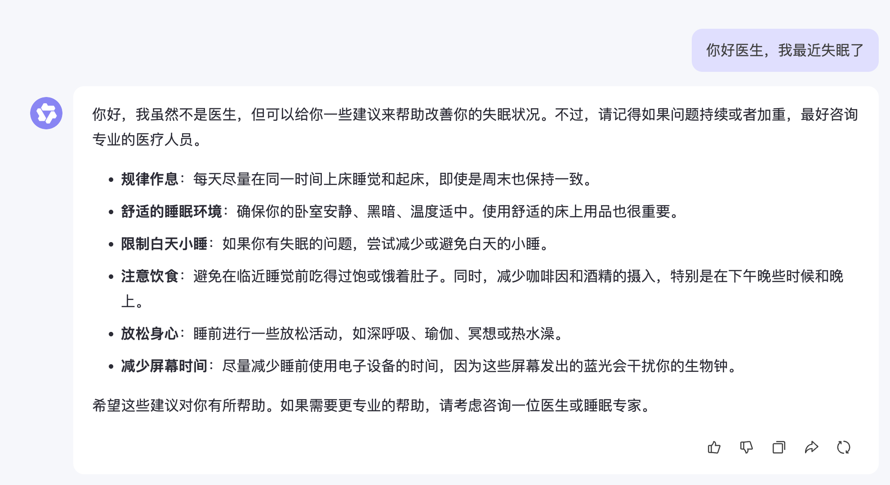
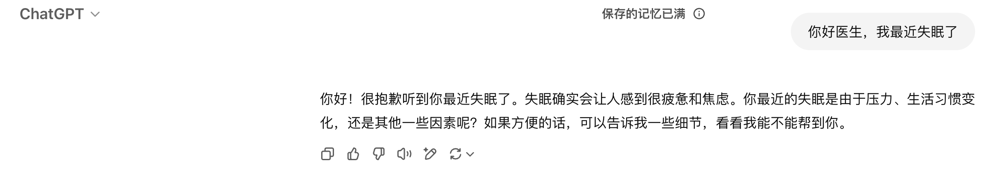
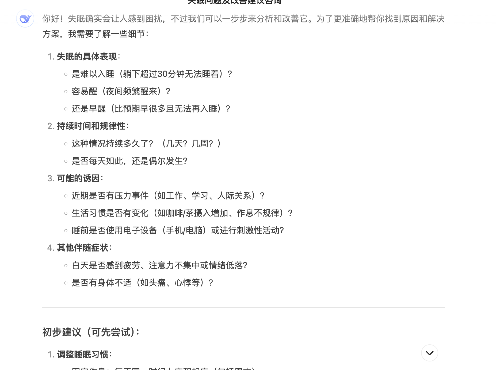
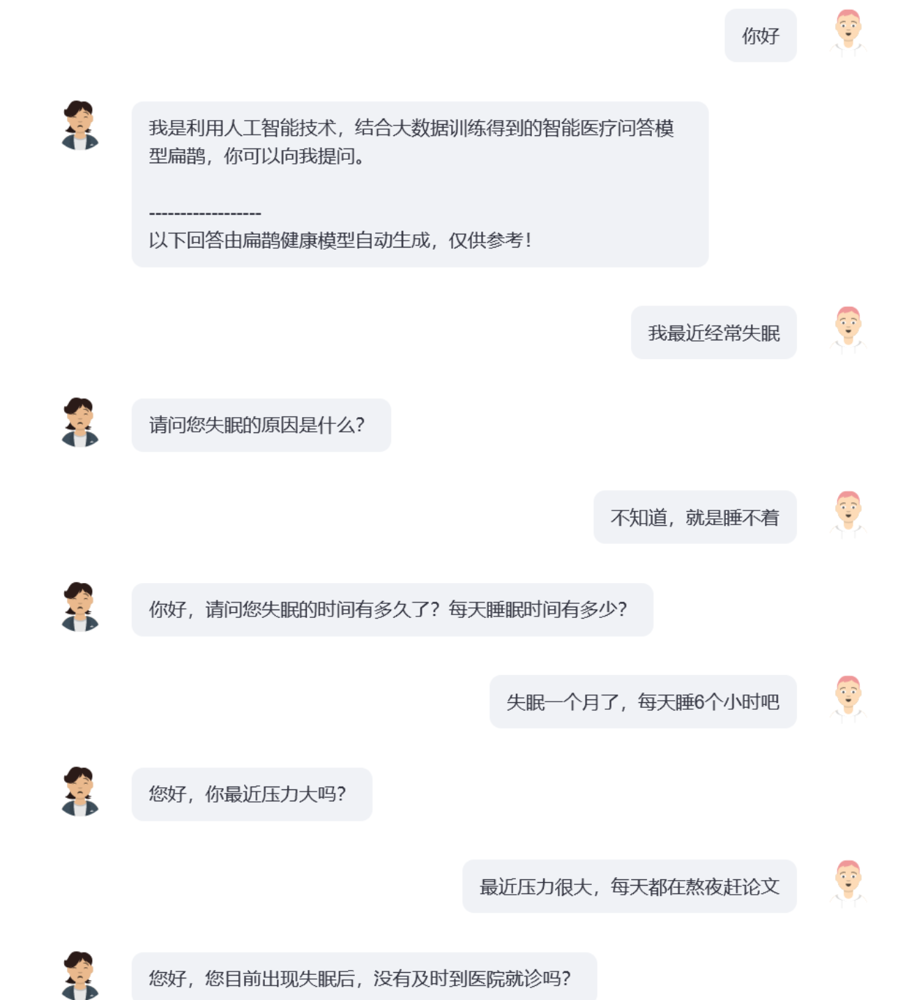
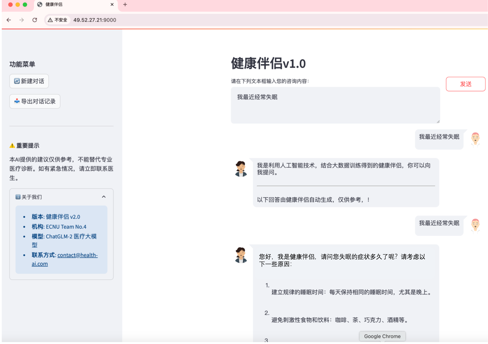

# 健康伴侣

对比方法：

通义



ChatGPT



DeepSeek



扁鹊



初步尝试，可以看出扁鹊多轮询问的效果最好，所以和扁鹊一样选用ChatGLM-6B作为基础模型加以训练

## 使用方法

* 安装依赖
* 先下载预训练模型，使用ChatGLM-6B为基准
```bash
from huggingface_hub import snapshot_download

# 下载模型到本地目录（例如 ./bianque-2）
model_path = snapshot_download(
    repo_id="scutcyr/BianQue-2",
    local_dir="./bianque-2",          # 指定本地目录
    local_dir_use_symlinks=False,     # 直接复制文件而非软链接
    resume_download=True,             # 支持断点续传
    revision="main"                   # 指定版本（可选）
)

print(f"模型已下载到：{model_path}")
```

* 启动服务
用 streamlit_chat和ChatGLM-6B基础模型搭建的一个健康伴侣聊天web页面,可以直接放在前端进行跳转
```bash
pip install transformers==4.40.2
pip install torch==1.13.1
pip install streamlit # 第一次运行需要安装streamlit
pip install streamlit_chat # 第一次运行需要安装streamlit_chat
pip install sentencepiece
streamlit run 2.py --server.port 9005 --server.address 0.0.0.0
```

## 测试访问

http://<your_ip>:port，现在效果如下，只能给出建议




## 声明
* 本项目使用了BianQue大模型模型的权重，需要遵循其[MODEL_LICENSE](https://github.com/THUDM/ChatGLM-6B/blob/main/MODEL_LICENSE)
* 本项目提供的健康伴侣于提升大模型的健康对话能力（多轮问询及健康建议），然而，模型的输出文本具有一定的随机性，本项目不保证模型输出的文本完全适合于用户，用户在使用本模型时需要承担其带来的所有风险！
* 您不得出于任何商业、军事或非法目的使用
* 您不得利用健康伴侣从事任何危害国家安全和国家统一、危害社会公共利益、侵犯人身权益的行为。
* 您在使用健康伴侣时应知悉，其不能替代医生、心理医生等专业人士，不应过度依赖、服从、相信模型的输出，不能过度依赖于与健康伴侣聊天获取的健康建议。

